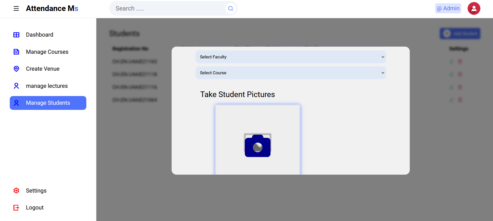

# FACE SCAN: An Automated Attendance Tracker

## Introduction

**Face Scan** is an automated attendance tracking system that leverages facial recognition technology to streamline attendance management in educational institutions. By integrating advanced biometric verification, the system reduces manual workload, eliminates proxy attendance, and enhances the accuracy of attendance records.

## Features

- **Facial Recognition Integration**: Utilizes MobileNet V1 and Tiny Face Detector models for accurate face detection and recognition.
- **User Roles**: Separate interfaces and functionalities for administrators and lecturers.
- **Data Management**: Perform CRUD operations for students, lecturers, courses, units, and venues.
- **Real-Time Attendance**: Live camera feed for attendance taking with immediate processing and recording.
- **Reporting**: Generate and export attendance reports in Excel format.
- **Responsive Design**: User-friendly interface compatible with various devices and screen sizes.
- **Security**: Secure authentication mechanisms with password hashing and session management.

## Technologies Used

### Frontend

- **HTML5**
- **CSS3**
- **JavaScript**
- **Face API.js**: For integrating facial recognition capabilities.
- **FileSaver.js** and **xlsx.js**: For exporting attendance data to Excel files.

### Backend

- **PHP**: Server-side scripting language for backend logic.
- **MySQL**: Relational database management system for data storage.

### Facial Recognition Models

- **MobileNet V1**
- **Tiny Face Detector**

## Installation

1.  **To clone the repository, run:**

```bash
git clone https://github.com/yourusername/facescan-attendance.git
```

2.  **Set up the database:**

    - Create a MySQL database named attendancemsystem.
    - Import the attendancesystem.sql file located in the root directory into your MySQL database.

3.  **Configure database connection:**

    - Update the dbcon.php file in the Includes directory with your database credentials.

4.  **Set up the web server:**

    - Ensure you have a local server environment like XAMPP, WAMP, or MAMP installed.
    - Place the project folder in the htdocs directory (for XAMPP) or the appropriate directory for your setup.

5.  **Install dependencies:**

    - The project uses JavaScript libraries included in the min/js and models directories.
    - Ensure all dependencies are properly referenced in your HTML files.

6.  **Run the application:**

    - Start your web server and navigate to `http://localhost/TFACERECOGNITION/` in your browser.

## Usage

### Administrator

- **Login**: Access the admin login page and enter your credentials.
- **Dashboard**: View summaries of registered students, lecturers, courses, and venues.
- **Manage Data**:

  - Add, edit, or delete students, lecturers, courses, units, and venues.
  - Upload student images for facial recognition.

- **View Reports**: Access and export attendance reports.

### Lecturer

- **Login**: Access the lecturer login page and enter your credentials.
- **Dashboard**: Select the course and venue for attendance.
- **Take Attendance**:

  - Launch the facial recognition module.
  - Monitor real-time attendance as students are recognized.

- **View Attendance**: Access attendance records for your courses.

## Screenshots

### Admin features

**1) Admin Login**  


**2) Admin Dashboard**  


**3) Manage Courses**  


**4) Create Venue**  


**5) Manage Lecturers**  


**6) Manage Students**  


**7) Add a Student**  


**8) Take Student's picture for face recognition**  


### Lecturer features

**1) Login as a Lecturer**  


**2) Take attendance by selecting course, class type and venue**  


**3) Facial Recognition**  


**4) View Students list registered for a particular course by filtering**  


**5) Export attendance as Excel sheet**  


## Contributing

Contributions are welcome! Please fork the repository and submit a pull request for review.

## Contact

For questions or feedback, please contact sakthiveloffcl@gmail.com
